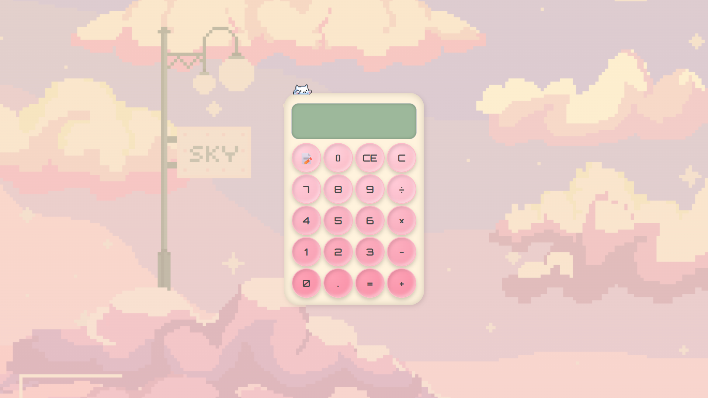
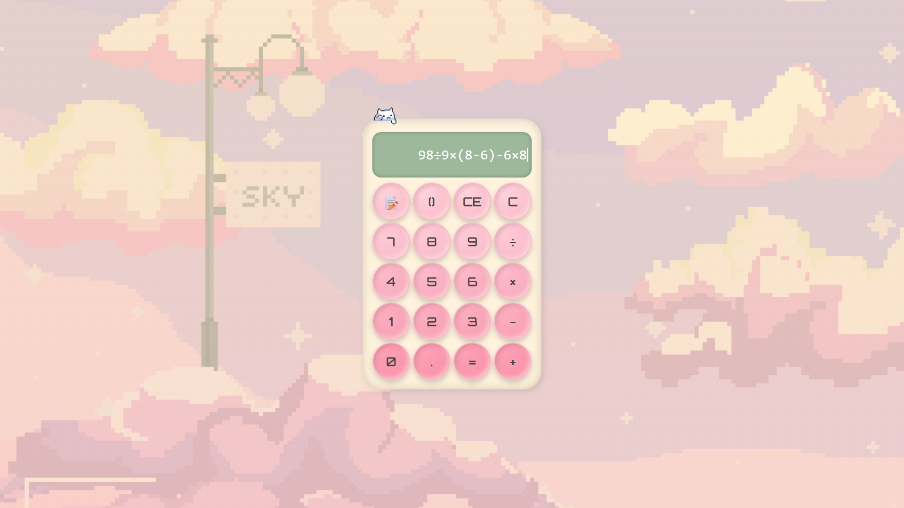
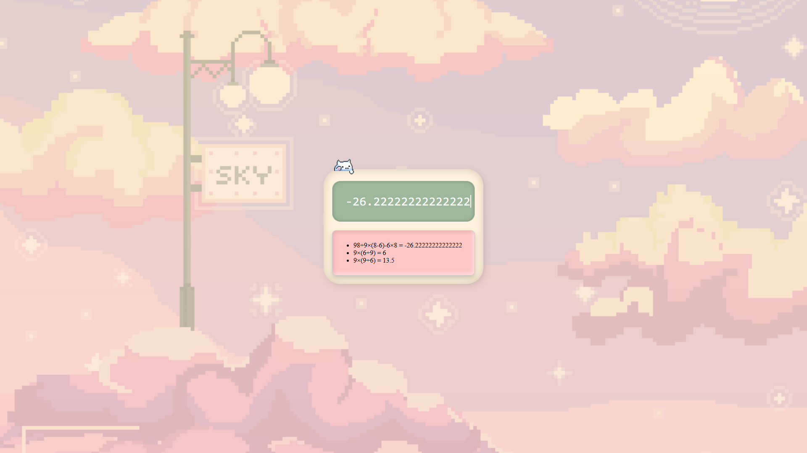

# Calculator-Web
A streamlined and minimalistic web based calculator application


# 🎨 Calculator App — Aesthetic Meets Functionality

Welcome to my **custom-built calculator web app** — where crisp logic meets a cozy interface. Inspired by tactile gadgets, soft UI trends, and retro tech vibes, this isn't just a tool for math — it's a little desktop moment of joy.

Think of it as your personal calculator with ✨personality✨.

---

## ✨ What Makes It Special?

* 🖱️ **Interactive Display**  
  Click anywhere to place a blinking caret — yes, even mid-expression! No more typing from scratch just to fix a typo.

* ⌨️ **Keyboard Power**  
  Navigate, delete, and insert with arrow keys and backspace — full editing support, just like your favorite text editor.

* 🧠 **Smart Input Handling**  
  Parentheses automatically pair, operations are neatly handled, and malformed expressions are corrected before evaluation.

* 🎞️ **Pixel-Playful UI**  
  Pastel buttons, hover bounces, a blinking caret, and a chill cat GIF lounging in the corner — every detail feels alive.

* 🔊 **Sound-Enhanced Typing**  
  Each click triggers a soft, satisfying sound. Input never felt this tactile.

* 📜 **Scrollable History Log**  
  Toggle the notebook icon to view a sliding panel of recent calculations — always at your fingertips.

---

## 📸 Visual Sneak Peek

<div align="center">
  
  
  
</div>

> 🎥 Want to see it in action? Watch the [demo video](assets/demo.mp4) for a full experience!

---

## 🚀 How to Run It

1. **Clone the repo**

```bash
git clone https://github.com/yourusername/calculator-app
cd calculator-app
```

2. **Open `index.html`** in your browser

> ⚠️ For audio and GIFs to work properly, launch via a local server (e.g. Live Server in VSCode).

---

## 💡 Under the Hood

### 🧩 Caret & Input System

The caret is dynamically placed based on your click — measuring character widths to simulate a real typing experience. Inserting or deleting characters respects the caret’s position.

### 🧠 Evaluation Engine

Before crunching numbers, your expression is sanitized:

* `×` and `÷` are converted to `*` and `/`
* Redundant symbols like `++` or `//` are auto-corrected
* Parentheses are balanced to prevent errors

### 🎨 UI Design

* Pastel button rows with subtle gradients  
* Monospaced display for exact spacing  
* Rounded edges, soft shadows, and a GIF-enhanced background that feels like a cozy digital notebook

### 🔊 Sound Effects

Built using the Web Audio API:

* Plays `/assets/click.mp3` on every input  
* Sound resets before replay to keep up with rapid presses

---

## 📁 Folder Structure

```
calculator-app/
├── index.html
├── css/
│   └── style.css
├── js/
│   └── renderer.js
├── assets/
│   ├── bg.gif
│   ├── catgif.gif
│   ├── click.mp3
│   └── demo.mp4
```

---

## ✅ Browser Support

| Browser | Status    |
| ------- | --------- |
| Chrome  | ✅ Perfect |
| Firefox | ✅ Smooth  |
| Safari  | ✅ Clean   |

> Fully responsive. Fully tested. Pixel-perfect on all major browsers.

---

## 📬 Feedback & Collab?

Have a suggestion? Want to remix the concept?  
I’d love to hear from you.

📧 **[meerafareena2905.email@.com](mailto:your.email@example.com)**  
💬 Or open an [issue](https://github.com/Meera2906/Calculator-web/issues)

---

## 🙏 Credits

* UI vibes inspired by vintage Casio calculators & cozy productivity tools  
* Fonts via [Orbitron](https://fonts.google.com/specimen/Orbitron)  
* Media from royalty-free sources  
* Built with 💖 using HTML, CSS, and JavaScript

---
